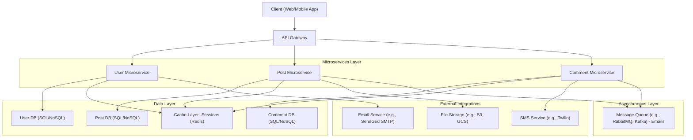

# Social Media User Management App

A user management system for a social media platform, allowing users to register, authenticate, follow/unfollow other users, and reset passwords (work-in-progress). This application provides functionalities to manage user accounts, relationships, and password security in a secure and scalable manner.

## Features

- **User Registration**: Allow users to register with their email and username.
- **User Authentication**: Users can log in using their credentials, with secure password hashing.
- **Follow/Unfollow Users**: Users can follow or unfollow other users.
- **Password Reset**: Users can request a password reset through email and change their password.
- **Profile Management**: Users can update their profile information.
- **Secure & Scalable**: Implements secure password hashing, token-based authentication, and scalable architecture.

## Technologies Used

- **ASP.NET Core**: Web API framework for building RESTful services.
- **Entity Framework Core**: ORM for database access.
- **SQL Server**: Database to store user and follow data.
- **JWT Authentication**: For securing user login and API calls.
- **SMTP/Email Service**: For sending password reset emails. (Incomplete)
- **AutoMapper**: For object-to-object mapping, simplifying code.

## API Endpoints

### 1. **User Registration**
`POST /auth/register`  
- Registers a new user with email, username, and password.

### 2. **User Login**
`POST /auth/login`  
- Logs in a user and returns a JWT token.

### 3. **User Logout**
`POST /auth/logout`  
- Logs out the user (invalidates JWT or session).

### 4. **Refresh JWT Token**
`POST /auth/refresh-token`  
- Refreshes the JWT token if expired or near expiration.

### 5. **Get User Profile**
`GET /users/{userId}`  
- Retrieves a user's profile information.

### 6. **Update User Profile**
`PUT /users/{userId}`  
- Updates a user's profile (e.g., name, bio, picture).

### 7. **Delete User Account**
`DELETE /users/{userId}`  
- Deletes a user’s account.

### 8. **Follow User**
`POST /users/{userId}/follow`  
- Allows a user to follow another user by their user ID.

### 9. **Unfollow User**
`POST /users/{userId}/unfollow`  
- Allows a user to unfollow another user.

### 10. **Get User's Followers**
`GET /users/{userId}/followers`  
- Retrieves the list of followers of a user.

### 11. **Get Users Following**
`GET /users/{userId}/following`  
- Retrieves the list of users the current user is following.

### 12. **Update User Email**
`POST /users/{userId}/update-email`  
- Updates the user's email address.

### 13. **Search Users**
`GET /users/search`  
- Searches for users based on a query (e.g., by username, name).  
  **Query Params**:
  - `query`: The search term.
  - `limit`: Number of results to return.


## Database Design

The database schema consists of the following tables:

- **Users**: Stores user details such as email, username, and password hash.
- **UserFollows**: Stores the follow relationships between users.
- **Sessions**: Stores the sessions of users. (Incomplete)

## Prerequisites

Before you start, ensure you have the following installed on your system:

- .NET SDK (Core 8.0 or later)
- SQL Server
- SMTP service for sending password reset emails (e.g., Gmail, SendGrid, etc.)
- Visual Studio or another code editor

## Getting Started

### 1. Clone the repository

```bash
git clone https://github.com/battletremor/social-media-user-management.git
cd social-media-user-management
```

## Architecure
The below architecture represents the complete picture of the three microservices



